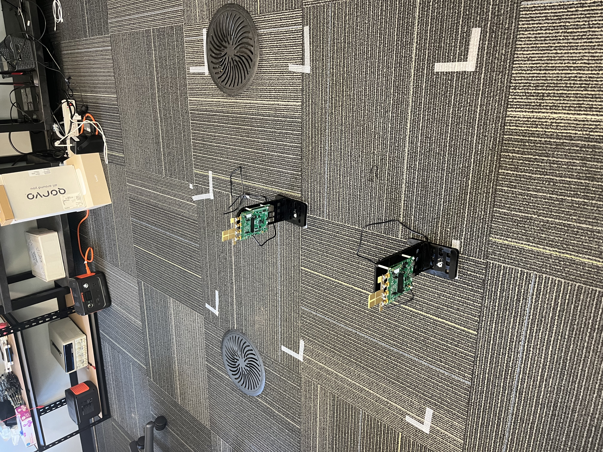
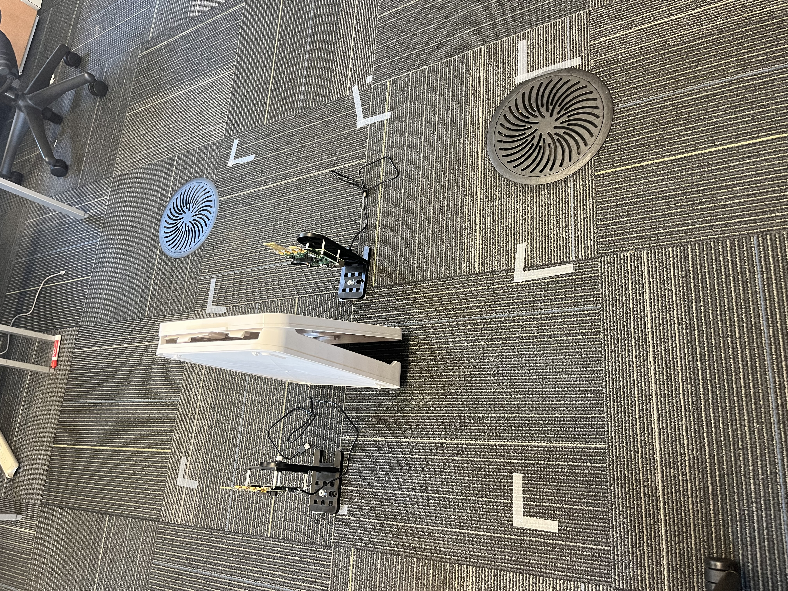

# UWB Indoor Localization with Bayesian Fingerprinting
### Qorvo QM35825 | Embedded Systems and Wireless IoT

---

## a. Introduction

### i. Problem Statement, Target Application, and High-Level Architecture

The Qorvo QM35825 measures distance to sub-10 cm accuracy and reports angle-of-arrival in real time, both visible live in the UWB Explorer GUI. The problem is that distance from one anchor is a sphere, and angle narrows it to a cone. Even with two anchors, the intersection of two cones in 3D space is not unique. Raw ranging and AoA alone cannot resolve a 3D position.

This project fixes that with fingerprinting. We collected measurements at 24 fixed 3D grid points arranged in a 1x1 m square, under both line-of-sight and obstructed conditions, across both anchors. Every location builds up a statistical signature across distance, AoA azimuth, AoA elevation, RSSI, and signal diagnostics. The model learns those signatures, including what obstructed signals look like, without needing to solve any geometry. The host-side pipeline then:

1. Parses and cleans raw UWB output logs
2. Statistically characterizes how obstruction affects each signal feature
3. Trains and evaluates multiple localization models (Random Forest, ExtraTrees, Bayesian fingerprinting)
4. Quantifies prediction uncertainty via Bayesian credible sets and calibration metrics
5. Validates generalization across independently collected repeated trials

**Why Bayesian fingerprinting on top of a chip that already ranges well?**
AoA cuts 3D localization error by 8-9% over ranging alone, but only where the angular geometry actually separates nearby points. Where obstruction deflects the signal, the angle reading is corrupted and AoA stops helping. The Bayesian model handles this by flagging those cases with low confidence instead of silently returning a wrong answer. You get a ranked list of candidate locations and a probability score, so you know when to trust the prediction and when not to.

**High-level architecture:**

```
+-----------------------------------------------------------+
|                     Physical Layer                        |
|  UWB Tag (mobile)  <---- IEEE 802.15.4z ---->  Anchor A   |
|                    <---- IEEE 802.15.4z ---->  Anchor B   |
+---------------------------+-------------------------------+
                            | USB serial / log files
                            v
+-----------------------------------------------------------+
|                   Host Python Pipeline                    |
|  1. parse  ->  2. analyze  ->  3. fingerprint  ->         |
|  4. Bayes  ->  5. calibrate  ->  6. cross-trial  ->       |
|  7. demo                                                  |
+-----------------------------------------------------------+
```

### ii. Key Features and Performance Summary

| Metric | Value |
|---|---|
| UWB standard | IEEE 802.15.4z (HRP UWB) |
| Ranging frequency | ~10 Hz per anchor |
| Measurement area | 1x1 m square, 24 3D grid points |
| Number of anchor nodes | 2 (fixed, known positions) |
| Number of calibration points | 24 (LOS + obstructed per point) |
| Mean 3D localization error, range only | ~0.70 m |
| Mean 3D localization error, range + AoA | ~0.64 m (Random Forest) |
| Mean 3D localization error, cross-trial | ~0.26 m (ExtraTrees, r1 to r2) |
| AoA contribution to error reduction | ~8-9% improvement over range alone |
| Obstruction detection accuracy | ~77% (Random Forest classifier) |
| 95% credible set coverage (Bayesian) | Tunable via temperature scaling |
| Live demo tool | UWB Explorer GUI (Qorvo) |
| Host language | Python 3.11 |
| Firmware modifications | None (stock Qorvo firmware) |

---

## b. Hardware Details

### i. Board(s) Used and MCU Details

| Component | Details |
|---|---|
| UWB Chip | **Qorvo QM35825** UWB transceiver |
| Development Kit | Qorvo QM35825 DK (Development Kit) |
| MCU (on-board host) | ARM Cortex-M33 (exact part: see board datasheet) |
| Interface to PC | USB CDC serial (stdout log output) |
| Anchor count | 2 units (anchorA, anchorB) |
| Tag count | 1 unit (mobile) |

> **Note:** Exact MCU part number and board revision should be filled in from your specific DK packaging. The QM35825 datasheet is available at [qorvo.com](https://www.qorvo.com).

### ii. Additional Peripherals

| Peripheral | Model / Description | Notes |
|---|---|---|
| Host computer | Any PC running Python 3.11 | Receives and logs serial output |
| USB cable | USB-A to USB-C (or Micro-USB, per DK) | One per anchor + one for tag |
| Tripod / mount | Standard camera tripod | Used to hold anchors at fixed heights |
| Obstruction material | Human body / cardboard | Placed between tag and anchor for obstructed trials |

> Add links to any specific peripherals or mounts purchased here.

### iii. Hardware Modifications

No hardware modifications were made to the Qorvo DK boards. The boards were used with:
- Stock firmware (unmodified)
- Factory antenna configuration
- No jumper changes from default

**Setup photos:**

Line-of-sight condition:


Obstructed condition:


**Anchor positions:**

AnchorA was placed at the center of the 1x1 m measurement grid. The tag was moved by hand to each of the 24 grid points surrounding it.

| Anchor | x (m) | y (m) | z (m) | Role |
|---|---|---|---|---|
| anchorA | 0.0 | 0.5 | 0.0 | Center of grid (fixed) |
| anchorB | TBD | TBD | TBD | Second fixed reference |

**Measurement grid:** 24 points on a 3D grid within a 1x1 m square. The tag was placed at each point by hand for both LOS and obstructed collections. Coordinates are encoded in filenames (e.g., `z050_xm050_y100` = z=0.5m, x=-0.5m, y=1.0m).

### iv. Power Subsystem

| Item | Details |
|---|---|
| Power source | USB bus power (5 V from host PC or USB hub) |
| On-board regulation | 3.3 V LDO (on DK board) |
| Estimated runtime | Unlimited (tethered USB) |
| Battery option | Not used in this experiment |
| Charging | N/A (USB powered) |

> If you add a battery-powered deployment, document battery type, capacity (mAh), and estimated runtime at the measured current draw here.

### v. RF Specifications

| Parameter | Value |
|---|---|
| Standard | IEEE 802.15.4z HRP UWB |
| UWB channel | Channel 5 (6.5 GHz center) or Channel 9 (8.0 GHz), confirm from firmware config |
| Bandwidth | ~500 MHz (HRP UWB) |
| Output power | Compliant with FCC Part 15 UWB limits (-41.3 dBm/MHz EIRP) |
| Antenna | Integrated on QM35825 DK (patch antenna) |
| Tested range | Up to ~5 m indoor (this experiment: 0.5 to 2.5 m) |
| Ranging method | Two-Way Ranging (TWR) |
| AoA method | Phase Difference of Arrival (PDoA) across antenna pairs |
| Compliance | FCC / CE (per Qorvo DK certification) |

---

## c. Software Environment

### i. Firmware

The firmware was not modified in this project. The stock Qorvo QM35825 DK firmware was used as-is, running the sample ranging application included in the Qorvo UWB SDK. No custom embedded code was written. All data collection, analysis, and machine learning runs on the host PC in Python.

### ii. Host Software

| Item | Details |
|---|---|
| Language | Python 3.11 |
| Package manager | pip |
| Dependency file | `requirements.txt` |
| OS compatibility | Windows 10/11, macOS 12+, Ubuntu 20.04+ |
| Special drivers | USB CDC serial driver (built into Windows 10+; on Linux: `cp210x` or `ch341` kernel module) |

**Dependencies (`requirements.txt`):**
```
numpy
pandas
scipy
scikit-learn
matplotlib
```

> Exact pinned versions: run `pip freeze > requirements_lock.txt` after installing and commit that file for full reproducibility.

### iii. Programming / Debugging Tools

| Tool | Version | Purpose |
|---|---|---|
| UWB Explorer GUI | Qorvo DK companion app | Live visualization of ranging, AoA, and diagnostics during data collection |
| `run_fira_twr` CLI | Qorvo UWB SDK | Command-line ranging session runner - used by the collection scripts |
| Python `pyserial` | via SDK venv | Captures stdout ranging logs to `.txt` files |
| Git | 2.x | Version control |

> J-Link and hardware debuggers were not used in this project - the stock firmware runs as-is and all output is captured via USB serial.

### iv. Radio Stack / Protocol Configuration

| Parameter | Value |
|---|---|
| PHY | HRP (High Rate Pulse) UWB |
| Channel | 5 or 9 (6.5 GHz / 8.0 GHz - confirm from DK default config) |
| PRF | 64 MHz |
| Data rate | 6.8 Mbps (standard UWB payload) |
| STS (Scrambled Timestamp Sequence) | Enabled (IEEE 802.15.4z secure ranging) |
| Ranging mode | Two-Way Ranging (TWR) |
| Session type | Scheduled (fixed interval, ~10 Hz) |

---

## d. Reproducibility Guide

### i. Hardware Assembly

**Anchor placement:**
1. Place **anchorA** at the center of the 1x1 m grid at position (x=0.0, y=0.5, z=0.0) m.
2. Place **anchorB** at its fixed reference position.
3. Connect both anchors to the host PC via USB.
4. Move the tag by hand to each of the 24 grid points for measurement.

**Pin map / wiring:** No custom wiring required - all connections are USB.

### ii. Environment Setup

**Requirements:** Python 3.11, pip, git.

```powershell
# Windows (PowerShell)
python -m venv analysis_venv
analysis_venv\Scripts\Activate.ps1
pip install -r requirements.txt
```

```bash
# macOS / Linux / WSL2
python3.11 -m venv analysis_venv
source analysis_venv/bin/activate
pip install -r requirements.txt
```

Verify the install:
```bash
python -c "import numpy, pandas, scipy, sklearn, matplotlib; print('OK')"
```

### iii. Build Instructions

**Firmware:** No build required. The stock Qorvo DK sample ranging application is used as-is.

**Host software:** No build required. All scripts run directly with Python.

### iv. Flashing and Provisioning

1. Connect the DK board via USB.
2. Flash the pre-built firmware binary from the Qorvo UWB SDK sample apps.
3. No pairing keys or provisioning needed - anchors and tag use default session IDs from the SDK.

### v. Running the Demo

**Step 1 - Collect data (already done; raw logs included in `raw/` and `trials/`).**

If re-collecting: place the tag at each grid point, run the Qorvo host app, and save the stdout output to a `.txt` file and the JSON diagnostic output to a `.json` file following the naming convention:
```
{z-coord}_{x-coord}_{y-coord}_{condition}_{anchor}_stdout.txt
{z-coord}_{x-coord}_{y-coord}_{condition}_{anchor}_diag.json
```
Example: `z050_xm050_y100_los_anchorA_stdout.txt`

**Live demo (UWB Explorer GUI):**

Before running the analysis pipeline, you can show real-time ranging and AoA using the **UWB Explorer** GUI that ships with the Qorvo DK:

1. Plug in both anchors via USB
2. Open UWB Explorer from the Qorvo SDK
3. Select both anchor ports and start a session
4. Move the tag around the room - the GUI shows live distance, azimuth, elevation, and RSSI updating in real time

This is the best way to demonstrate what the chip is doing at the hardware level before showing how the Python pipeline builds localization and uncertainty quantification on top of it.

**Step 2 - Run the full pipeline (from the project root):**

```bash
# 1. Parse raw logs → processed/measurements_clean.csv
python scripts/process_qorvo_dataset.py --raw-dir raw --out-dir processed

# 2. Full analysis + ML models + plots
python scripts/analyze_qorvo_complete.py

# 3. Aggregate fingerprint model
python scripts/aggregate_fingerprint_model.py

# 4. Bayesian uncertainty quantification
python scripts/latent_bayes_uncertainty.py

# 5. Temperature calibration sweep
python scripts/true_posterior_temperature_sweep.py

# 6. Cross-trial generalization (r1 → r2)
python scripts/trial_generalization_analysis.py

# 7. Run the offline Bayesian demo on r2 test data
python scripts/demo_bayes_r2_table.py
```

**Expected final output (Step 7):**
```
=== Bayesian r2 demo table ===
true_point   true_condition  pred_point   pred_condition  error_m  top1_prob  credible95_size
z000_x000_y000  los          z000_x000_y000  los         0.00     0.72       3
...

=== Demo summary ===
n_windows  top1_point_accuracy  mean_error_m  mean_credible95_size
8          0.75                 0.26          4.2
```

### vi. Testing and Measurement

**Reproducing key metrics:**

| Metric | Script | Output file |
|---|---|---|
| LOS vs obstructed statistics | `analyze_qorvo_complete.py` | `processed/los_vs_obst_stats.csv` |
| Random Forest localization error | `analyze_qorvo_complete.py` | `processed/localization_model_results.csv` |
| Fingerprint model error | `aggregate_fingerprint_model.py` | `processed/aggregate_localization_results.csv` |
| Bayesian accuracy + calibration | `latent_bayes_uncertainty.py` | `processed/latent_bayes_uncertainty_results.csv` |
| Temperature sweep | `true_posterior_temperature_sweep.py` | `processed/true_posterior_temperature_sweep.csv` |
| Cross-trial generalization | `trial_generalization_analysis.py` | `processed/trial_generalization_r1_to_r2_results.csv` |
| Demo predictions | `demo_bayes_r2_table.py` | `processed/demo_bayes_r2_table.csv` |

**View results as formatted tables:**
```bash
# Windows PowerShell
Import-Csv processed\demo_bayes_r2_summary.csv | Format-Table

# macOS / Linux
column -s, -t < processed/demo_bayes_r2_summary.csv
```

**Test datasets:** The `raw/` folder contains the full r1 dataset (96 files = 24 points Ã- 2 conditions Ã- 2 anchors Ã- 2 file types). The `trials/` folder contains both r1 and r2 trial data.

### vii. Troubleshooting

| Problem | Likely cause | Fix |
|---|---|---|
| `ModuleNotFoundError` | venv not activated | Run `analysis_venv\Scripts\Activate.ps1` (Windows) or `source analysis_venv/bin/activate` (Mac/Linux) |
| `FileNotFoundError: measurements_clean.csv` | Scripts run out of order | Run `process_qorvo_dataset.py` or `analyze_qorvo_complete.py` first |
| `FileNotFoundError: trials_r1_r2_measurements_clean.csv` | Step 6 skipped | Run `trial_generalization_analysis.py` before `demo_bayes_r2_table.py` |
| `Missing folder: trials/r1/raw` | Wrong working directory | Run all scripts from the project root, not from inside `scripts/` |
| Empty `processed/` folder | Scripts not yet run | Run scripts in the order listed in section d.v above |
| Plot windows block execution | matplotlib backend | Add `import matplotlib; matplotlib.use('Agg')` at the top of the script if running headless |
| Low cross-trial accuracy | Expected - see results | Condition accuracy drops to ~65% on r2; this is documented behavior |

### viii. Offline Mode

This project has no cloud connectivity - it is entirely offline. All data is stored locally in `raw/` and `trials/`. All scripts run on a local Python environment with no internet access required after initial `pip install`.

To run fully air-gapped:
1. Download the repo and install dependencies on a networked machine first.
2. Copy the entire project folder (including `analysis_venv/`) to the offline machine.
3. All 7 scripts run without any network calls.

### ix. Security Keys and Tokens

This project has no cloud connectivity and requires no API keys or credentials. Everything runs locally - hardware to USB to host Python scripts. No accounts, tokens, or internet connection are needed beyond the initial `pip install`.

---

## e. Repository Structure

```
.
├── raw/                        # r1 raw measurement logs (96 files)
│   └── {z}_{x}_{y}_{cond}_{anchor}_{kind}.{ext}
├── trials/
│   ├── r1/raw/                 # r1 data in trial-folder format
│   └── r2/raw/                 # r2 repeated-trial subset (4 points)
├── scripts/
│   ├── process_qorvo_dataset.py        # Step 1: parse raw logs
│   ├── analyze_qorvo_complete.py       # Step 2: analysis + ML models
│   ├── aggregate_fingerprint_model.py  # Step 3: fingerprint localization - isolates AoA contribution
│   ├── latent_bayes_uncertainty.py     # Step 4: Bayesian inference
│   ├── true_posterior_temperature_sweep.py  # Step 5: calibration
│   ├── trial_generalization_analysis.py    # Step 6: cross-trial test
│   └── demo_bayes_r2_table.py          # Step 7: offline demo
├── docs/                       # Result summaries
├── processed/                  # Generated CSVs (gitignored, recreate via scripts)
├── plots/                      # Generated plots (gitignored)
├── plots_deeper/               # Generated plots (gitignored)
├── requirements.txt
├── .gitignore
└── README.md
```

---

## References

- Qorvo QM35825 product page: [qorvo.com](https://www.qorvo.com)
- IEEE 802.15.4z standard (HRP UWB): [ieee.org](https://standards.ieee.org/ieee/802.15.4z/10375/)
- UWB sniffer reference project: [github.com/seemoo-lab/uwb-sniffer](https://github.com/seemoo-lab/uwb-sniffer)
- Scikit-learn documentation: [scikit-learn.org](https://scikit-learn.org)

